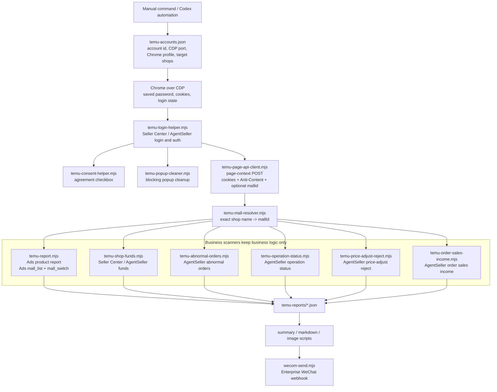

# Development Memory

This file records project implementation decisions and development conventions.
It is not an API reference. Keep Temu endpoint details in `temu_API.md`; keep
operator-facing usage in `README.md`.

## Agent Architecture Map

Use this map before adding or changing scanner scripts. The main rule is:
reuse the login, page API, and mall resolver helpers; keep each business
scanner focused on its own endpoints, validation, and output shape.



When adding or changing order-income collection:

- keep using `scripts/temu-order-sales-income.mjs` as the dedicated consumer;
- start from each region's AgentSeller order page, then let
  `loginSellerIfNeeded()` settle auth;
- use page-context requests for browser-authenticated API calls and detail HTML;
- resolve target shops through `resolveMallByExactName()` and exact
  `temu-accounts.json` shop names;
- keep DOM shop switching enabled by default for this scanner;
- write stable JSON under `temu-reports/` before adding any image or WeCom
  delivery layer.

## 2026-06-12 WONDER Funds Account

`temu-accounts.json` now includes account id `wonder`, display label `WONDER`,
CDP port `9224`, and profile
`/Users/vure/ReportDalily/temu-chrome-cdp-profile-wonder`.

`WONDER` does not participate in Ads daily reports: keep
`dailyReportEnabled: false`, and keep daily-report account iteration filtering
out accounts with that flag.

The only configured shop is exact mall name `Wonder Products`
(`mallId=634418216261468`). Seller Center returned `isSemiManagedMall: true`,
so treat it as a semi-managed shop for funds collection. It participates in:

- `temu-order-sales-income`
- `temu-shop-funds`
- `temu-withdraw-records-sync`

Initial validation artifacts:

- `temu-shop-funds-2026-06-12T06-55-46-022Z.json`: settled funds
  `CNY 1,257.23`, pending funds `CNY 4,469.84`.
- `temu-order-sales-income-2026-06-12T06-56-34-292Z.json`: 2026-06-01 to
  2026-06-12, EU `0` orders and US `1` not-shipped zero-income row.
- `temu-withdraw-records-2026-06-12T06-57-20-876Z.json`: successful withdrawal
  records `247`, total `CNY 1,304,400.00`; submit dry-run showed
  store-not-found auto cursor and `Records: 247`.

For all Chrome CDP collectors, default to headless/no-disturbance execution.
Use visible Chrome only for manual login, SMS/captcha/slider verification,
inspection after failure, or an explicit user request.

## 2026-06-07 Seller Center Login Refactor

Seller Center and AgentSeller login handling is centralized in
`scripts/temu-login-helper.mjs`.

Current consumers:

- `scripts/temu-report.mjs`
- `scripts/temu-abnormal-orders.mjs`
- `scripts/temu-operation-status.mjs`
- `scripts/temu-shop-funds.mjs`
- `scripts/temu-price-adjust-reject.mjs`

Keep business extraction, shop matching, JSON output, image generation, and
Enterprise WeChat delivery outside the login helper.

### Ownership Boundaries

- `scripts/temu-report.mjs` still owns the `ads.temu.com` entry flow.
- `scripts/temu-login-helper.mjs` owns Seller Center login, Seller Center
  authorization, AgentSeller `auth/authentication` transition handling, page
  close recovery, and login-page state classification.
- `scripts/temu-consent-helper.mjs` owns agreement checkbox detection and
  clicking.
- API behavior and endpoint notes belong in `temu_API.md`, not here.

### Login URL States

Treat these URLs as not-ready/login-transition pages:

- `https://seller.kuajingmaihuo.com/login`
- `https://seller.kuajingmaihuo.com/settle/seller-login`
- `https://seller.kuajingmaihuo.com/settle/activity-login`
- `https://agentseller.temu.com/auth/authentication`
- `https://agentseller-eu.temu.com/auth/authentication`
- `https://agentseller-us.temu.com/auth/authentication`

Do not treat URL alone as positive proof of readiness. Use URL as a negative
signal, then let the target business page/API prove readiness.

### Seller Center State Machine

`loginSellerIfNeeded()` classifies Seller Center pages into these practical
states:

- `seller_identity_login`: account/password login page, including QR-first pages
  after switching to phone or email login.
- `seller_authorize`: authorization confirmation page with labels such as
  `确认授权并前往`, `授权并前往`, `授权登录`, or `同意并登录`.
- `seller_pending`: login URL is present but the DOM has not exposed enough
  usable login or authorization controls yet.
- `transition_closed`: the old login page closed during a redirect or successful
  login transition.
- `verification_required`: SMS, captcha, slider, or similar human verification.
- `ready`: not on a known login/authorization transition page.

Important behavior:

- `seller_pending` waits on its own timeout and must not consume real login
  attempts.
- Increment login attempts only immediately before clicking the login or
  authorization button.
- If the old login/auth page remains open but another page has already moved to
  Seller Center or AgentSeller, prefer the transitioned page.
- If a page closes while saved-password autofill is running, search the browser
  context for a live transitioned page before failing.
- Verification-required pages are external blockers. Fail clearly instead of
  retrying as a normal login failure.

### Consent Checkbox Rule

On `settle/seller-login` and `settle/activity-login`, the account/password flow
must actively check the authorization agreement before filling the password and
before clicking authorization/login.

The consent helper must recognize long authorization text such as:

```text
您授权您的账号ID和店铺名称...
```

If this checkbox is missed, the page can repeatedly retry or remain on the login
form even though credentials were filled.

### AgentSeller Authentication Middle Page

For `agentseller*.temu.com/auth/authentication`, click the `中国地区 / 商家中心`
row using structural selectors first:

- root: `#sca-auth-root`
- row: class containing `authentication_regionItem`
- region text: class containing `authentication_regionPre`
- click target: class containing `authentication_goto`

Keep the older text/parent fallback because Temu may change CSS-module suffixes
or page nesting.

### Verification Guidance

For login-helper changes, run at least:

```bash
node --check scripts/temu-consent-helper.mjs \
  scripts/temu-login-helper.mjs \
  scripts/temu-report.mjs \
  scripts/temu-abnormal-orders.mjs \
  scripts/temu-operation-status.mjs \
  scripts/temu-shop-funds.mjs \
  scripts/temu-price-adjust-reject.mjs

git diff --check
```

Use a synthetic page test for consent-checkbox ordering when the real CDP
profile is already logged in. A no-send full report run does not prove the
logged-out Seller Center login path unless the relevant CDP profile is actually
logged out or manually placed on the target login page first.

When a real logged-out verification is needed, use:

```bash
TEMU_SEND_WECOM=0 TEMU_ACCOUNT_RETRY_ATTEMPTS=1 TEMU_OPERATION_ACCOUNT_RETRY_ATTEMPTS=1 npm run temu:report:all:image
```

Do not count this as login-path proof if the run starts from an already logged-in
Chrome profile.

### Real Logged-Out Verification Notes

Do not validate Seller Center login by opening these pages directly:

- `https://seller.kuajingmaihuo.com/settle/activity-login`
- `https://seller.kuajingmaihuo.com/settle/seller-login`

Those direct URLs can miss the required source context and show transient
messages such as `获取公钥失败，请刷新页面` or `请访问agentSeller主页操作登录`.
That is not the same as the production automation path.

Use the real upstream entry instead:

- Ads report login path: clear the profile login state, then start from the
  ads report flow (`npm run temu:report`) so Ads triggers `settle/activity-login`.
- AgentSeller login path: clear the profile login state, then start from an
  AgentSeller business page such as `https://agentseller.temu.com/goods/list`
  or run `npm run temu:operation-status` so AgentSeller triggers
  `auth/authentication -> settle/seller-login`.

The `获取公钥失败` page is treated as a transient Seller Center login failure. The
helper may do a limited refresh, but if it does not recover, the practical
resolution is to restart from the correct upstream entry and log in again.

## 2026-06-07 Data Scanner Architecture Phase 1

The first reusable data-scanning slice is intentionally small. Do not add a
generic scanner directory or runner until more scripts have been migrated and
the interface has settled.

New shared helpers:

- `scripts/temu-page-api-client.mjs`: browser-page POST/JSON helper for Temu
  API calls that need the current page context, cookies, optional `mallid`, and
  AgentSeller `Anti-Content`.
- `scripts/temu-mall-resolver.mjs`: exact-only mall resolver for
  Seller Center, AgentSeller, and Ads mall-list shapes.

Current consumers:

- `scripts/temu-operation-status.mjs`
- `scripts/temu-abnormal-orders.mjs`
- `scripts/temu-price-adjust-reject.mjs`
- `scripts/temu-shop-funds.mjs`
- `scripts/temu-report.mjs`

These scripts now demonstrate the intended split:

- login/authentication stays in `scripts/temu-login-helper.mjs`;
- page-context API transport stays in `scripts/temu-page-api-client.mjs`;
- exact mall lookup stays in `scripts/temu-mall-resolver.mjs`;
- each consumer keeps only its own business-specific collection, validation,
  JSON formatting, and message summarization.

For `scripts/temu-report.mjs`, login and authorization can still use DOM because
Temu login depends on Chrome profile state, saved passwords, consent checkboxes,
and Seller Center authorization. After login, product daily data must stay API
only: use Ads `mall_list` plus `mall_switch` for shop selection, then
`queryReports` plus `ads_report` for data. Do not restore page UI shop switching,
region/date clicking, table parsing, sort clicking, or API-failure DOM fallback.

Ads `ads_report` is bound to the current Ads session shop: tested `mallid`
headers, request-body mall fields, and URL query mall fields are ignored by that
endpoint. Keep Ads API `mall_switch`; do not try to split shops by passing
`mallid` directly to `ads_report`.

Future scanner work should migrate scripts incrementally, one consumer at a time,
preserving existing JSON shape, error codes, and delivery behavior. Keep exact
shop-name matching; do not introduce fuzzy mall matching.

## 2026-06-08 Order Sales Income Scanner

`scripts/temu-order-sales-income.mjs` is the dedicated order sales income
collector. Keep it separate from product daily reports, abnormal orders,
operation status, and shop funds.

Business scope:

- Only collect configured semi-managed shops from `temu-accounts.json`, unless
  `TEMU_ORDER_SALES_SHOPS` explicitly narrows the shop list.
- Default regions are EU and US:
  - EU: `https://agentseller-eu.temu.com/mmsos/orders.html`
  - US: `https://agentseller-us.temu.com/mmsos/orders.html`
- Each account and each region must enter its own AgentSeller order page and
  settle login/authentication before collection.
- Use the existing account CDP profile, login helper, consent helper, page API
  client, cleanup helper, and exact mall resolver. Do not create a separate
  order-income login flow or a separate Chrome profile.

Collection model:

- Use page-context API calls for order list requests so cookies, login state,
  `Anti-Content`, and `mallid` are supplied by the live browser page.
- Resolve shops with `resolveMallByExactName()` only. Do not fuzzy-match shop
  names and do not default to all shops.
- The order list page size is `500`.
- By default omit `fulfillmentMode` in the order-list API request so all
  fulfillment forms are included for the semi-managed shop. If a narrow test
  needs a specific mode, set `TEMU_ORDER_SALES_FULFILLMENT_MODE=0` or `1`.
- Do not send request-body `fulfillmentMode=9`; earlier validation showed
  URL/UI "全部订单" can work while request-body `9` can return inconsistent rows.
- DOM shop switching is required by default for this scanner. The detail HTML
  and visible current shop can diverge when relying only on `mallid`, so keep
  `TEMU_ORDER_SALES_DOM_SWITCH` enabled unless debugging a known-safe path.
- Before entering `/mmsos/orders.html`, preselect the first requested
  semi-managed shop on the AgentSeller home/authentication page when possible.
  If the profile currently lands on a full-managed shop, that shop can lack
  order-page permission and the seller-center authorization page can bind to the
  wrong shop.
- Detail sales income is parsed from the `order-detail.html` document HTML.
  Verified by clicking a real list-row `订单详情` link: the HTML document itself
  contained `销售收益`, `销售回款`, `订单货款`, `运费回款`, and `实际收入`.
- A cold direct fetch of `order-detail.html` can return only the shell/i18n
  page. Treat the correct list/page/session context as part of the contract.

Zero-income order classification:

- Detect cancellation from the order-list API before requesting detail HTML.
  Signals include `parentOrderMap.parentOrderStatus === 3`,
  all `orderList[].orderStatus === 3`, or cancel quantity without shipped or
  fulfillment quantity.
- Cancelled orders must be saved as normal output rows with
  `orderStatus: "已取消"`, every income amount set to `0`, and
  `source.type: "orderList"`, `source.reason: "cancelled"`, and
  `remark: "已取消订单按 0 记录"`.
- Orders detected from the order-list API as `待发货` / `未发货` / `待履约` /
  `待处理` must also be saved as zero-income rows before requesting detail HTML.
  Use `source.reason: "notShipped"` and
  `remark: "待发货/未发货订单按 0 记录"`. API quantity signals such as
  `unShippedQuantity > 0` count even when no Chinese status text is present.
- Delivered orders whose detail page shows `实际收入 = 0` because sales repayment
  is fully offset by sales chargeback and shipping repayment is fully offset by
  shipping chargeback are `签收后退款订单`. Keep the platform `orderStatus`
  such as `已签收`, but add `source.reason: "refundAfterDelivery"` and
  `remark: "签收后退款订单"`.
- Keep separate stats for cancellation/not-shipped candidates and actual zero rows:
  `cancelledCandidateCount` records how many cancelled candidates appeared in
  scanned list pages; `notShippedCandidateCount` records how many not-shipped
  candidates appeared in scanned list pages; `skipped.cancelledAsZero` and
  `skipped.notShippedAsZero` record how many were written into the result set as
  zero-income orders.

Performance and limits:

- `TEMU_ORDER_SALES_DETAIL_CONCURRENCY` defaults to `4` and is hard-capped at
  `4`, even if a higher value is supplied. Worker count is
  `min(concurrency, candidateCount)`, so tiny shops do not start more workers
  than they have candidate orders.
- After the first detail pass, retry failed detail orders for two additional
  rounds. Preserve attempt errors in `failedDetails[].attemptErrors` if all
  retries still fail.
- Normal order-income runs close pages and the CDP Chrome process after
  collection. During interactive repeated test runs only, set
  `TEMU_CLOSE_CHROME_PROCESS=0` to keep Chrome warm between runs, and optionally
  set `TEMU_CLOSE_CHROME_PAGES=0` if the page itself must remain open.
- `TEMU_ORDER_SALES_LIMIT` means per account per region when
  `TEMU_ORDER_SALES_LIMIT_PER_SHOP` is not set.
- If a region or shop has fewer eligible orders than the limit, use the actual
  eligible count as `expectedOrders` so "不足就取全部" succeeds.

Useful commands:

```bash
npm run temu:order-sales-income
TEMU_ACCOUNT_ID=setonr TEMU_ORDER_SALES_REGIONS=eu TEMU_ORDER_SALES_SHOPS='SETONR Products' TEMU_ORDER_SALES_DATE=2026-05-01 TEMU_ORDER_SALES_LIMIT=5 npm run temu:order-sales-income
node --check scripts/chrome-cdp.mjs
node --check scripts/temu-page-api-client.mjs
node --check scripts/temu-order-sales-income.mjs
```

Verification samples from implementation:

- EU `SETONR Products`, `2026-05-01`, requested concurrency `8`, output
  `detailConcurrency=4`.
- EU `SETONR Products`, `2026-05-01`, 22-order sample wrote cancelled orders
  such as `PO-069-07665616661112020` and `PO-076-07999576149114063` with all
  income fields set to `0`.
- US `SETONR Products`, `2026-05-01`, limit `100`, total list count `9`,
  output saved `9/9` with `targetMet=true`.
